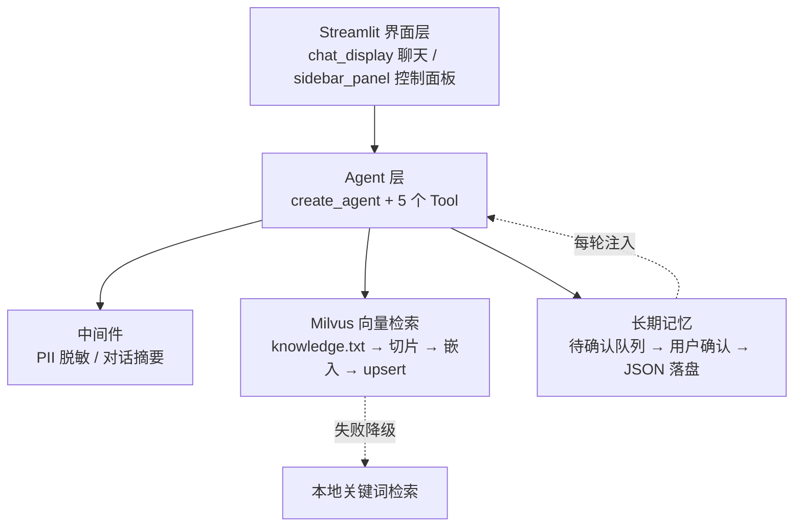

# 💞 AI 智能伴侣（Agent + RAG）

基于 LangChain 与 Streamlit 构建的 AI 情感陪伴智能体。区别于"调 API 的聊天机器人"，本项目实现了一套完整的 Agent 应用链路：**工具调用、向量检索（RAG）、跨会话长期记忆、内容安全中间件、多级容灾降级**。

## 核心特性

| 模块 | 实现 |
|---|---|
| 对话内核 | `create_agent` 组装智能体，5 个 Function Calling 工具由模型自主规划调用 |
| 知识检索 | Milvus + Qwen3-Embedding(4096 维) 向量检索，COSINE 相似度，语料切片入库 |
| 长期记忆 | 跨会话 JSON 持久化 + "提交 → 人工确认 → 落盘" 的 HITL 审核流程 |
| 安全与上下文 | PII 双层脱敏（手机号 / 18 位身份证 / 邮箱）：输入入口先掩码再落盘/展示（身份证隐藏后8位、邮箱隐藏@前6位、手机号只留尾4位，旧会话加载时补脱敏），3 个 PIIMiddleware 在模型调用前按身份证→手机→邮箱顺序兜底；SummarizationMiddleware 超 24 轮自动摘要压缩 |
| 结构化输出 | Pydantic 约束情绪分析字段（心情指数 / 情绪标签 / 关怀建议），驱动可视化报告 |
| 前端交互 | Streamlit fragment 局部刷新、流式打字输出、自定义 CSS/JS 优化 |

### 工具清单

- `get_time_info` — 时间、日期、星期查询
- `get_weather` — 实时天气（open-meteo 免费接口，含模拟数据兜底）
- `search_love_knowledge` — 恋爱沟通知识库向量检索
- `remember_user_info` — 提交待确认记忆
- `recall_user_info` — 按话题检索长期记忆

## 架构



## 容灾设计

项目对外部依赖均设计了降级路径，任一环节故障时服务仍然可用：

| 依赖 | 降级链 |
|---|---|
| LLM | DeepSeek → 通义千问 qwen-plus → qwen-turbo → SiliconFlow Qwen3-8B（启动时逐个探活并缓存） |
| 嵌入模型 | SiliconFlow Qwen3-Embedding-8B(4096 维) → DashScope text-embedding-v3(1024 维) |
| 向量库 | Milvus 向量检索 → 本地 bigram 关键词检索 |
| 天气数据 | open-meteo 实时接口 → 内置模拟数据 |

## 快速开始

### 1. 环境准备

```bash
git clone <your-repo-url>
cd AI智能伴侣项目
python -m venv .venv
.venv\Scripts\activate          # Windows
pip install -r requirements.txt
```

### 2. 配置密钥

```bash
copy .env.example .env          # macOS / Linux: cp .env.example .env
```

编辑 `.env`，至少填入一个 LLM 的 API Key（DeepSeek / DashScope / SiliconFlow 任一）。

### 3. 启动 Milvus（可选）

未启动 Milvus 时程序会自动降级为关键词检索，不影响运行；如需向量检索能力：

```bash
docker run -d --name milvus-standalone \
  -p 19530:19530 -p 9091:9091 \
  milvusdb/milvus:latest standalone
```

### 4. 运行

```bash
streamlit run app.py
```

首次对话时若集合为空，会自动完成语料切片、嵌入与入库（懒加载）。

## 数据来源

知识库语料 `knowledge.txt` 由开源数据集加工生成，非人工撰写：

- **来源**：HuggingFace `sunorme/chinese-adorable-high-emotional-intelligence-chat`（170 条高情商沟通对话）
- **原始数据**：`raw_data/chinese-adorable-high-eq-chat.json`
- **加工脚本**：`build_knowledge.py`
- **手写版备份**：`knowledge_handwritten.txt`（早期版本，保留以便对比）

## 目录结构

```
AI智能伴侣项目/
├── app.py                      # 主程序：界面 + Agent + RAG + 记忆
├── build_knowledge.py          # 语料加工脚本
├── knowledge.txt               # 知识库语料（RAG 数据源）
├── knowledge_handwritten.txt   # 手写版语料备份
├── raw_data/                   # 原始数据集
├── requirements.txt
├── .env.example                # 环境变量模板
└── sessions/                   # 会话记录目录（运行时生成，已被 .gitignore 排除）
```

## 已知限制与后续计划

- 尚未引入自动化评估：计划补充 30 组测试对话，使用 LLM-as-judge 对"共情度、人设一致性、知识库调用正确性"打分
- 向量库为单机部署，尚未涉及并发与成本控制
- 语料规模有限（170 条），后续计划扩充并引入重排序（rerank）

## License

MIT
